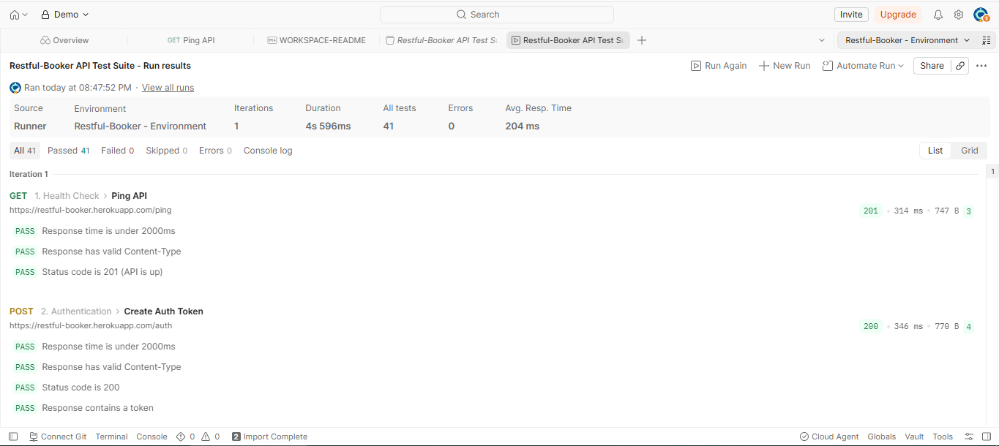
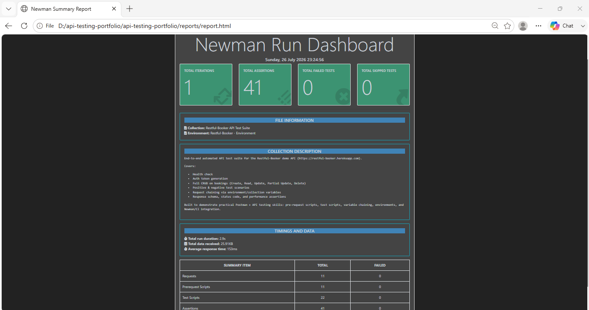

# Restful-Booker API Test Suite (Postman + Newman + CI)

[](https://github.com/YOUR-USERNAME/restful-booker-api-tests/actions/workflows/api-tests.yml)

An automated REST API test suite built in **Postman**, executed with **Newman**, and wired into a **GitHub Actions CI pipeline**. This project demonstrates practical, real-world API testing skills - not just sending a request and eyeballing the response, but writing repeatable, chained, self-validating automated tests.

**API under test:** [Restful-Booker](https://restful-booker.herokuapp.com) - a free public API purpose-built for practicing API test automation (auth, CRUD, sessions).

---

## What this project demonstrates

- **Postman fundamentals** - collections, folders, environments, variables
- **Authentication flows** - generating and reusing a bearer/cookie token across requests
- **Full CRUD coverage** - Create, Read, Update (PUT), Partial Update (PATCH), Delete
- **Request chaining** - passing data (`bookingId`, `authToken`) between requests using environment variables
- **Assertions / test scripts** - status codes, response schema, field-level data validation, response time
- **Negative & security testing** - invalid IDs (404), unauthorized writes (403), malformed payloads
- **Automation & CI/CD** - the entire suite runs headlessly via **Newman** and is triggered automatically on every push, pull request, and a daily schedule using **GitHub Actions**
- **Reporting** - HTML (`htmlextra`) and JUnit reports generated on every run and uploaded as build artifacts

---

## Project structure

```
api-testing-portfolio/
├── postman/
│   ├── collections/
│   │   └── Restful-Booker-API-Tests.postman_collection.json
│   └── environments/
│       └── Restful-Booker.postman_environment.json
├── .github/
│   └── workflows/
│       └── api-tests.yml        # CI pipeline that runs the suite on every push
├── reports/                      # Newman HTML/JUnit reports land here
├── package.json                  # Newman scripts
└── README.md
```

---

## Test coverage

| Folder | Request | Method | What's asserted |
|---|---|---|---|
| Health Check | Ping API | GET | API is reachable (201) |
| Authentication | Create Auth Token | POST | 200, token exists, token saved for later steps |
| Booking CRUD | Create Booking | POST | 200, response body matches payload, `bookingid` saved |
| Booking CRUD | Get Booking by ID | GET | 200, returned data matches created booking |
| Booking CRUD | Get All Booking IDs | GET | 200, response is a non-empty array |
| Booking CRUD | Update Booking (PUT) | PUT | 200, fields fully replaced, requires auth token |
| Booking CRUD | Partial Update (PATCH) | PATCH | 200, only targeted field changes |
| Booking CRUD | Delete Booking | DELETE | 201, requires auth token |
| Negative Tests | Get non-existent booking | GET | 404 |
| Negative Tests | Update without auth token | PUT | 403 |
| Negative Tests | Create with missing fields | POST | API doesn't silently 200 with bad data; response time still healthy |

Every request also runs two **collection-level** checks automatically: response time under 2s, and a valid `Content-Type` header.

---
## Sample Test Run

**Postman Collection Runner — all requests passing:**


**Newman Report:**


## How to run this yourself

### Option 1 - Postman GUI
1. Import `postman/collections/Restful-Booker-API-Tests.postman_collection.json`
2. Import `postman/environments/Restful-Booker.postman_environment.json`
3. Select the environment in the top-right dropdown
4. Click **Run** (Collection Runner) to execute the whole suite in order

### Option 2 - Newman (command line)
```bash
npm install
npm test
```
This runs the full suite headlessly and generates an HTML report at `reports/report.html`.

### Option 3 - Let CI do it
Every push to `main` (and a daily scheduled run) automatically triggers the [GitHub Actions workflow](.github/workflows/api-tests.yml), which runs the same Newman suite and uploads the report as a downloadable build artifact.

---

## Tools & tech used

`Postman` · `Newman` · `Node.js` · `GitHub Actions` · `JavaScript (pm.test / Chai assertions)` · `JSON`

---

## Notes

Restful-Booker is a shared public sandbox, so booking IDs and state can be modified by other users running the same tests — that's expected and part of why the suite creates its own booking, captures its ID, and cleans up (deletes it) at the end of each run rather than relying on fixed/static IDs.

---

## About

Built as a hands-on portfolio project to demonstrate API testing with Postman, test automation, and CI/CD integration.

Feel free to fork this, point it at a different public API, or extend it with more edge cases - contributions and suggestions are highly appreciated.
